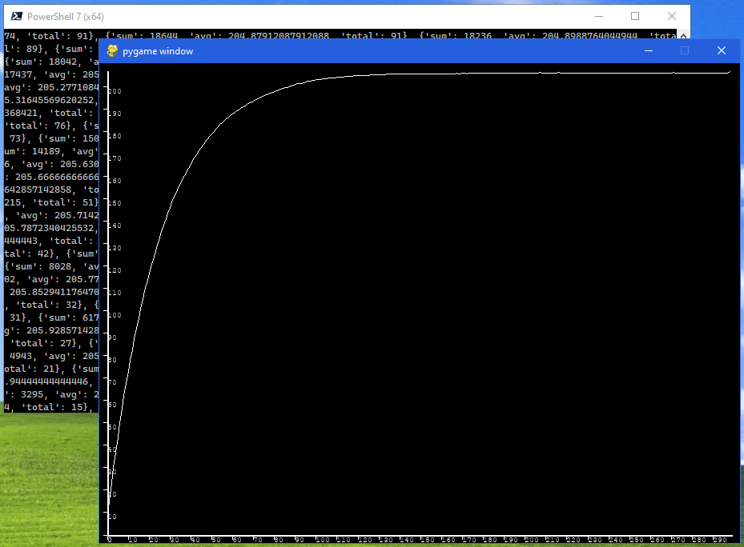

# couponcollectorproblem

For a collection of 207 cards purchased in packs of 8 (Minecraft: Time To Mine from Panini)

Run 100 simulations

Each simulation opens packs and collects unique cards until all 207 cards are collected

construct a data set indexed by number of packs open and record sum,avg,total cards collected after opening 'number of packs'

plot a graph of average number of cards after opening a specific number of packs

